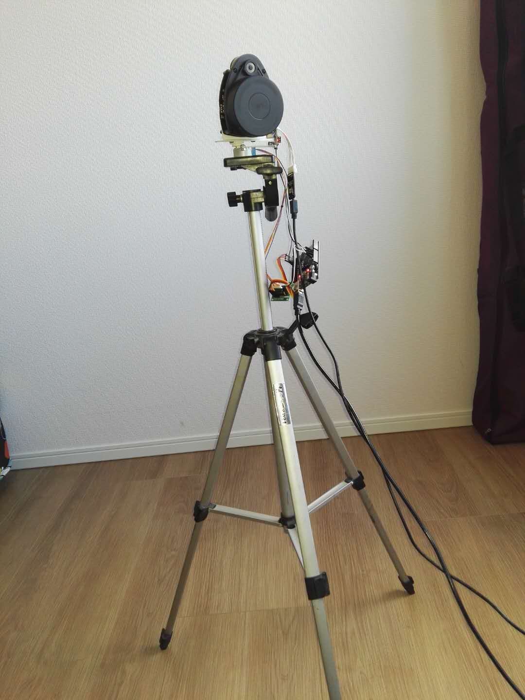

# DIY激光雷达3D测量扫描仪介绍
用上海思嵐科技的RPLIDAR—A1型号，DIY了一个3D测量扫描仪。RPLIDAR—A1是基于三角形测量原理的传感器。具体见  
<http://www.slamtec.com/cn/lidar/A3>  
该设计是做平面测量扫描的。

# 设计成3D测量扫描
本来RPLIDAR自己带有一个旋转运动，只做平面测量扫描，即2D的。  
为了实现3D测量扫描，需要增加一个运动：  
1、平移运动  
2、旋转运动    
3、平移加旋转运动  
考虑容易入手的理由，选择2。  

# DIY原型机照片


# diy设计的元器件构成
|No.| 名称      | 数量 | 备注 |
|---| ------------- |---------------|---------------|
|1|RPLIDAR本机 |1 | 即传感器|
|2|USB-UART模块 |1 | RPLIDAR套装|
|3|UNO|1 | 单片机|
|4|步进马达|1 | |
|5|光电开关|1 | |
|6|杜邦线|9|公母头 |
|7|三脚架|1 | |
|8|电脑|1 | |
|9|USB1|1|安卓手机小口 |
|10|USB2|1|方口 |
|11|机械零部件|3|3D打印 |
|12|螺丝螺母|4|M2.5 |


# 采样数据视频示例
<https://www.youtube.com/watch?v=YGQJd-3JXq0>

# UNO代码

``` 
u8 i,j;
  for(j=0;j<4;j++){
     for(i=0;i<4;i++)t[i]=s[i];
     t[j]=HIGH;
     for(i=0;i<4;i++)digitalWrite(p[i], t[i]); 
     delay(5);
   } 
}
void ccw(void){
  u8 i,j;
  for(j=0;j<4;j++){
     for(i=0;i<4;i++)t[i]=s[i];
     t[3-j]=HIGH;
     for(i=0;i<4;i++)digitalWrite(p[i], t[i]); 
     delay(5);
     flg=0x99;   
     Serial.write(flg); 
   } 
}
void org(){while(c==0){
  c=digitalRead(speedPin);cw();delay(5);}ccw();
}

void rset()
{
    c=digitalRead(speedPin);
    if(c==0)org();
     else
     {
      while(c==1){ c=digitalRead(speedPin);ccw();delay(20);}
      org();flg=0xaa;
 //     Serial.write(flg);
     }
}

void loop() {
  delay(50);
  switch(flg)
  {
    case 0x55:rset();flg=0;break; //reset 55
    case 0x56:cw();c=digitalRead(speedPin);Serial.write(c);break;//clockwise 56
    case 0x57:ccw();c=digitalRead(speedPin);Serial.write(c);break;//counterclockwise 57
    case 0x58:Stop(); break; //stop
    case 0x5a:c=digitalRead(speedPin);cw();Serial.write(c);flg=0;delay(50);break;//step cw
    default:break; 
  }

}

void serialEvent() {
  while (Serial.available()) {
    inChar = (char)Serial.read();
    flg=inChar;
 //   Serial.write(flg);
    return;
  }
}
```


# PC代码

``` 
BOOL CMySrlDlg::OnInitDialog()
{
 CDialog::OnInitDialog();

 SetIcon(m_hIcon, TRUE);   // Set big icon
 SetIcon(m_hIcon, FALSE);  // Set small icon
 
 // TODO: Add extra initialization here
 m_port.InitPort(this,3,115200,'n',8,1);m_port.StartMonitoring();
 m_poru.InitPort(this,5,115200,'n',8,1);m_poru.StartMonitoring();
 GetDlgItem(IDC_BUTTON5)->ShowWindow(SW_HIDE);
 GetDlgItem(IDC_BUTTON2)->ShowWindow(SW_HIDE);
 SetWindowPos(NULL,0,0,1920,1080,NULL);//窗口最大化
 CreateDirectory("JPG\\",NULL);
 CreateDirectory("DAT\\",NULL); 
 long lIndex=-2030;
 hBrd= okOpenBoard(&lIndex);
 okLoadImageFile(hBrd,"a001.jpg",0,BUFFER,0,1);
 byt=(BYTE *)okGetBufferAddr(hBrd,0);
 SetRect(&rct,2,26,2+WIDTH,26+HEIGHT);
 okSetTargetRect(hBrd,SCREEN,&rct);
 SetWindowPos(NULL,0,0,1920,1080,NULL);
 return TRUE;  // return TRUE  unless you set the focus to a control
}

void CMySrlDlg::OnButton7() //Start
{
 // TODO: Add your control notification handler code here

 dttm=CTime::GetCurrentTime( );
 CString str;
 char st[80];
 str.Empty();
 str+="D:\\LiDar\\";
 str+=dttm.Format("%Y%m%d%H%M\\");
 sprintf(st,"%s",str);m_lst.AddString(st);
 CreateDirectory(st,NULL); 
 str+="a.dat";sprintf(st,"%s",str);
 m_lst.AddString(st);

 pfg=fopen(st,"wb");
 hThrd8=::CreateThread(NULL,0,(LPTHREAD_START_ROUTINE)Thrd8,NULL,0,&dwThreadid);//Queue Thrd8
 if(SetThreadPriority(hThrd8,THREAD_PRIORITY_BELOW_NORMAL)==0)
 AfxMessageBox("ThreadPriority Failure!",MB_OK,0);
 chr[0]=0xA5;chr[1]=0x20;
 m_poru.WriteToPort(chr,2); //Queue the Lidar
 Sleep(10);
 Count=FULL;     //Set data length
}

LONG CMySrlDlg::OnCommunication(WPARAM ch, LPARAM port)
{
 static long  cnt=0;     //initialize the counter
 if(port==3)       //other UART
 {
//  if(ch==0x99){Count--;pntr=pntw;}
  return 0;
 }
 if(cnt<7){cnt++;return 0;}   //jump over head
 rcvBf[(Count%2)*szBf+pntw++]=ch; //save data & inc pointer
 pntw%=szBf;       //limit the pointer
 if(pntw==pntr)flg=1;    //Buffer  over
 return 0;
}

DWORD Thrd8(LPVOID)
{ 
 CMySrlDlg *pDlg = (CMySrlDlg *)(AfxGetApp()->GetMainWnd());
 char st[80];
 float dg,ln;
 unsigned int k,k0=0;
 int fcnt=0;
 FXYZ f1[sz5];
 while(Count<0){Sleep(10);continue;} //if Lidar not ready
 long tm;
 tm=GetTickCount();
 for(;;)
 { 
  if(Count>0)
  {
   sprintf(st,"Count=%03d",Count);pDlg->SetWindowText(st);
   if(flg==1)          //Buffer full
   {
    flg=0;          //Buffer  reset
    chr[0]=0x5a;m_port.WriteToPort(chr,1);  //motor one step clockwise
    k0=(Count%2)*szBf;       //loop range
    for(k=k0;k<k0+szBf;k+=5)     //every 5 bytes = 1 point
    {
     fcnt=(k-k0)/5;
     f1[fcnt].x=(FULL-Count)*UNIT;       //rotation angle
     f1[fcnt].y=dg=float(rcvBf[k+2]*256+rcvBf[k+1])/128.; //Lidar angle
     f1[fcnt].z=ln=float(rcvBf[k+4]*256+rcvBf[k+3])/4;  //Lidar radius
    }
    fwrite(f1,sizeof(FXYZ),sz5,pfg);       //save a frame of sample data
    Sleep(50);   //wait for rotation motor ; this could be interactive
    Count--;
    pntr=pntw;
    if(Count==0)  //all frames are gotten
    {
     fclose(pfg);
     chr[0]=0xa5;chr[1]=0x25;m_poru.WriteToPort(chr,2); //Stop Lidar
     pDlg->m_lst.AddString("Finished!");
     chr[0]=0x55;m_port.WriteToPort(chr,1);    //rotation reset
     Count=-1;pntw=0;
     tm=GetTickCount()-tm;
     sprintf(st,"tm=%d(ms)",tm);
     pDlg->m_lst.AddString(st);
     return 0;
    }
   }
  }
 }
 return 0;
}
```